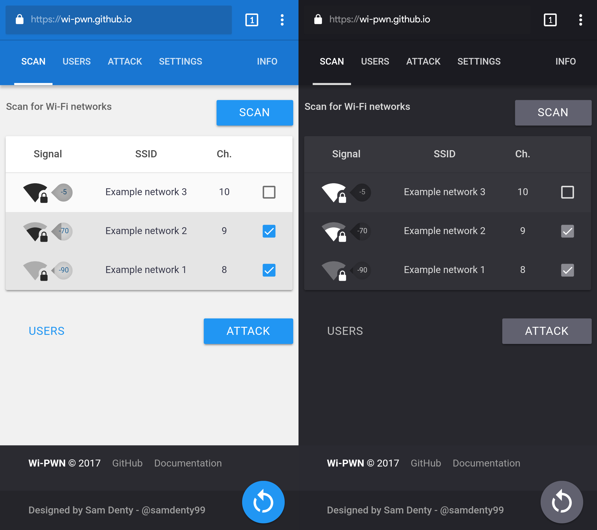
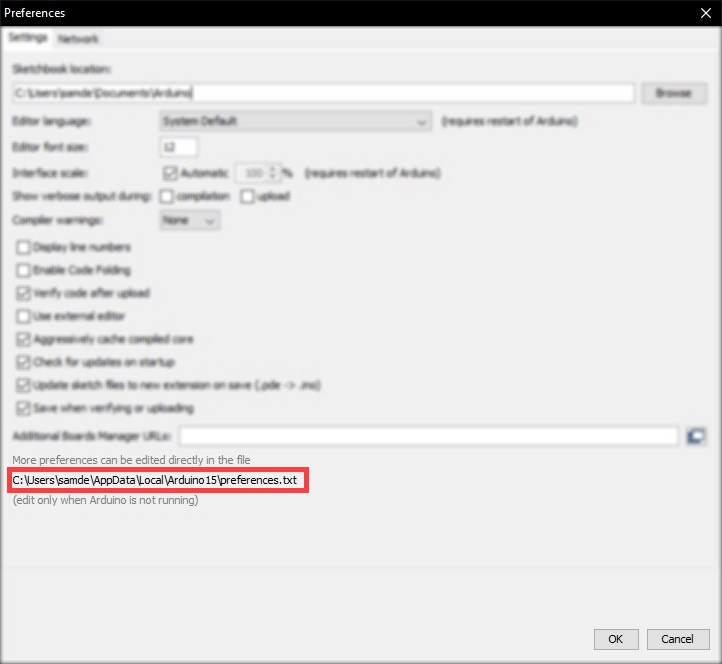
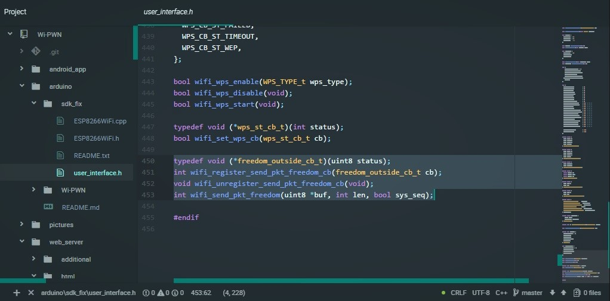
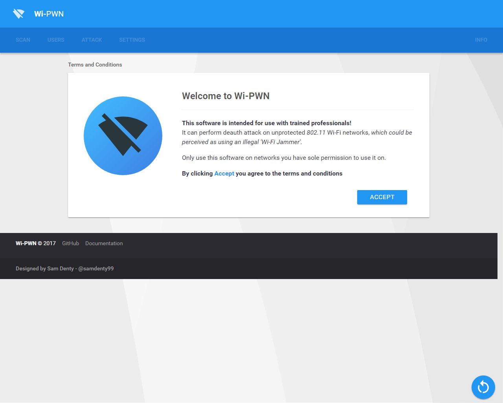
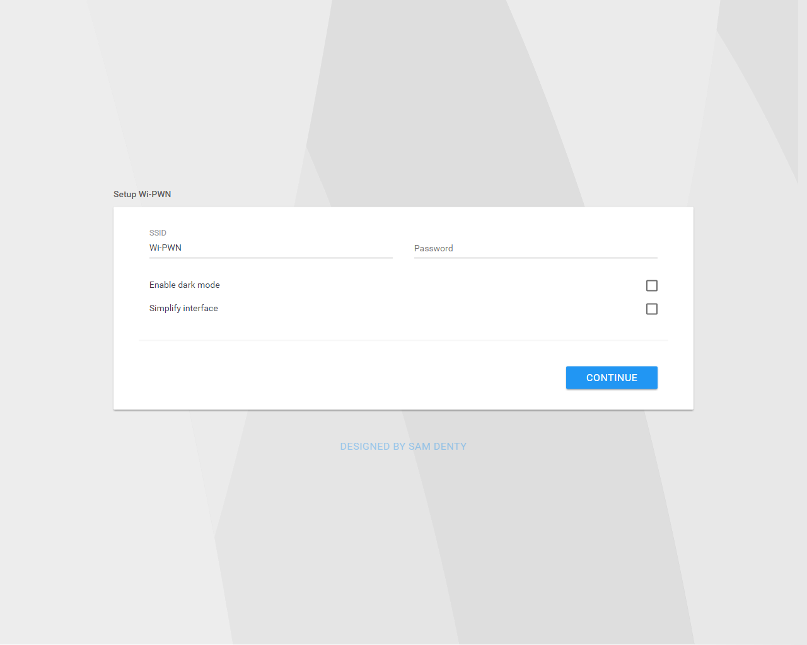
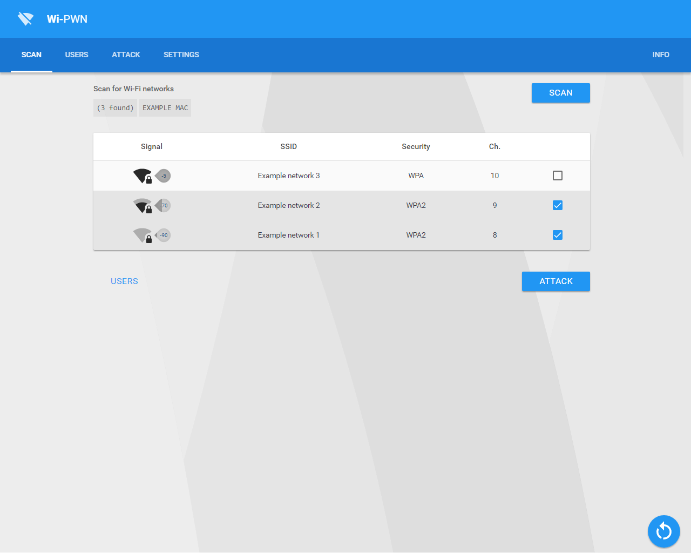
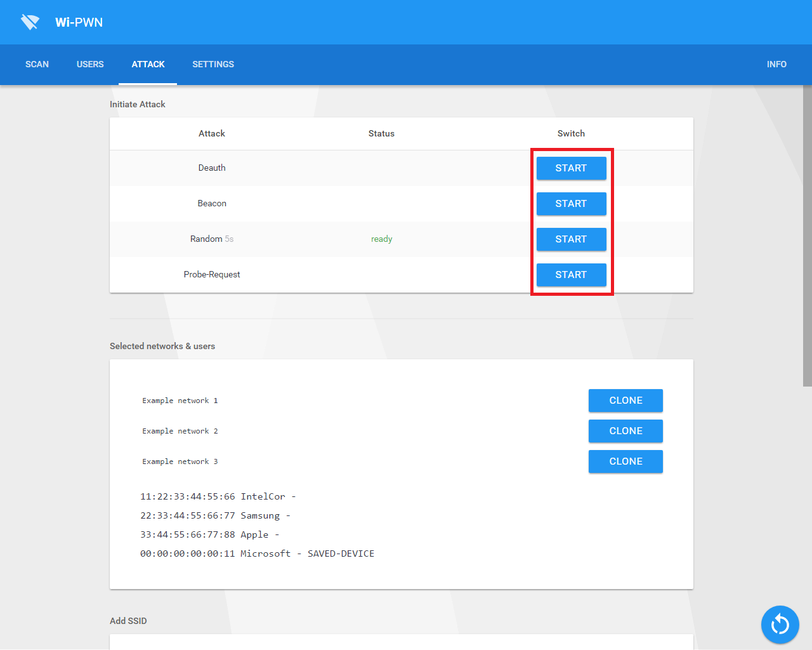

  

  <h3 align="center">Wi-PWN</h3>

  

    ESP8266 Deauther with a clean & minimalistic web interface 
     
    <b><a href="https://samdenty99.github.io/r?https://Wi-PWN.github.io">Online demo</a> | <a href="https://samdenty99.github.io/r?https://github.com/samdenty99/Wi-PWN/wiki">Browse the docs</a> | <a href="https://samdenty99.github.io/r?https://github.com/samdenty99/Wi-PWN/projects/1?fullscreen=true">Upcoming features</a></b>
     
     
    
    
    
	
    
	

<h2></h2>

## Table of Contents
- [Introduction](#introduction)
  - [What is Wi-PWN](#what-is-Wi-PWN)
  - [How it works](#how-it-works)
  - [How to protect against it](#how-to-protect-against-it)
- [Installation](#installation)
  - [Flashing with NodeMCU-Flasher](#nodemcu)  
  - [Compiling with Arduino](#arduino)
- [How to use it](#how-to-use)
- [FAQ](#faq)
- [License](#license)
- [Sources and additional links](#sources-and-additional-links)

## Introduction ##

### What is Wi-PWN

Wi-PWN is a firmware that performs [deauth attacks](https://en.wikipedia.org/wiki/Wi-Fi_deauthentication_attack) on cheap Arduino boards. The [ESP8266](https://en.wikipedia.org/wiki/ESP8266) is a cheap micro controller with built-in Wi-Fi. It contains a powerful 160 MHz processor and it can be programmed using [Arduino](https://www.arduino.cc/en/Main/Software).

A deauthentication attack is often confused with [Wi-Fi jamming](https://en.wikipedia.org/wiki/Radio_jamming#Method), as they both block users from accessing Wi-Fi networks.

### How it works

The 802.11 Wi-Fi protocol contains a so called [deauthentication frame](https://mrncciew.com/2014/10/11/802-11-mgmt-deauth-disassociation-frames/). It is used to disconnect clients safely from a wireless
network.

Because these management packets are unencrypted, you just need the MAC address of the Wi-Fi router and of the client device which you want to disconnect from the network. You don’t need to be in the network or know the password, it’s enough to be in its range.

### How to protect against it

With the [802.11w-2009](https://en.wikipedia.org/wiki/IEEE_802.11w-2009) updated standards, management frames are encrypted by default.

[802.11w](https://en.wikipedia.org/wiki/IEEE_802.11w-2009) is rarely used in the real world as both the router **and the client device** need to support this standard, otherwise they won't be able to connect to the routers.

Updating to the [802.11w](https://en.wikipedia.org/wiki/IEEE_802.11w-2009) standard is often expensive and difficult due to the vast devices of legacy devices not supporting the new standard. Because of the maintenance nightmare, over 95% of devices use the vulnerable 802.11 standard — even though newer devices support newer standards.

## Installation

Requirements:

- ESP8266 module (any board)  
- Micro-USB cable
- Computer

I would recommend getting a USB breakout/developer board, mainly due to the 4Mb of flash and simplicity.  

In order to upload the Wi-PWN firmware, you can use one of two methods. The first method is easier overall but using Arduino is better for debugging.
**YOU ONLY NEED TO DO ONE OF THE INSTALLATION METHODS!**

### Check which serial controler u have

There are two variants of the NodeMCU boards:

1. The NodeMCU with a CP210x controller supports native drivers in Windows 10. Or you can find the drivers [here](https://github.com/samdenty99/Wi-PWN/tree/master/drivers/CP210x).

2. The NodeMCU with a CH340x controller need additional drivers. You can find them [here](https://github.com/samdenty99/Wi-PWN/tree/master/drivers/CH34x).

### Method 1: Flashing with NodeMCU-Flasher  

1. [Download](https://github.com/samdenty99/Wi-PWN/releases/latest) the current release of Wi-PWN

2. Upload the `.bin` file using the [nodemcu-flasher](https://github.com/nodemcu/nodemcu-flasher/raw/master/Win64/Release/ESP8266Flasher.exe). Alternatively you can use the official [esptool](https://github.com/espressif/esptool) from espressif.

3. Connect your ESP8266 (making sure the drivers are installed) and open up the *NodeMCU Flasher*
4. Go to the `Advanced` tab and select the correct values for your board.
5. Navigate to the `config` tab and click the gear icon for the first entry.
6. Browse for the `.bin` file you just downloaded and click open.
7. Switch back to the `Operation` tab and click <kbd>Flash(F)</kbd>.

### Method 2: Compiling with Arduino

1. [Download the source code](https://github.com/samdenty99/Wi-PWN/archive/master.zip) of this project.

2. Install [Arduino](https://www.arduino.cc/en/Main/Software) and open it.

3. Go to `File` > `Preferences`

4. Add `http://arduino.esp8266.com/stable/package_esp8266com_index.json` to the *Additional Boards Manager URLs.* (refer to [https://github.com/esp8266/Arduino](https://github.com/esp8266/Arduino))

5. Go to `Tools` > `Board` > `Boards Manager`

6. Type in `esp8266`

7. Select version `2.0.0` and click on `Install` (**must be version 2.0.0!**)  

8. Go to `File` > `Preferences`

9. Open the folder path under `More preferences can be edited directly in the file`  

10. Go to `packages` > `esp8266` > `hardware` > `esp8266` > `2.0.0` > `tools` > `sdk` > `include`

11. Open `user_interface.h` with a text editor

12. Just before the last line `#endif`, add the following:

<b></b>

    typedef void (*freedom_outside_cb_t)(uint8 status);
    int wifi_register_send_pkt_freedom_cb(freedom_outside_cb_t cb);
    void wifi_unregister_send_pkt_freedom_cb(void);
    int wifi_send_pkt_freedom(uint8 *buf, int len, bool sys_seq);

13. Go to the [arduino/SDK_fix](https://github.com/samdenty99/Wi-PWN/arduino/SDK_fix) folder of this project

14. Copy `ESP8266Wi-Fi.cpp` and `ESP8266Wi-Fi.h` to
    `C:\Users\%username%\AppData\Local\Arduino15\packages\esp8266\hardware\esp8266\2.0.0\libraries\ESP8266WiFi\src`

16. Open `arduino/Wi-PWN/esp8266_deauther.ino` in Arduino

17. Select your ESP8266 board at `Tools` > `Board` and the right port at `Tools` > `Port`  
**If no port shows up you need to reinstall the drivers**, search online for chip part number + 'driver Windows'

18. Depending on your board you may have to adjust the `Tools` > `Board` > `Flash Frequency` and the `Tools` > `Board` > `Flash Size`. I used the `80MHz` Flash Frequency, and the `4M (1M SPIFFS)` Flash Size

19. Upload! <kbd>CTRL-U</kbd>

**Note:** If you use a 512kb version of the ESP8266, you need to comment out a part of the mac vendor list in `data.h`

## How to use

1. Connect your ESP8266 to a USB power source (you can power it with your phone using an OTG cable)

2. Scan for Wi-Fi networks on your device and connect to `Wi-PWN` (no password by default).  

3. Once connected, open up your browser and go to `http://192.168.4.1`  

4. Click on <kbd>ACCEPT</kbd> to accept the Terms &amp; Conditions  

5. Specify a SSID and password for Wi-PWN to use and click on <kbd>CONTINUE</kbd>  

6. Reconnect to the new network using the SSID &amp; Password you specified in the previous step.
7. Go back to your browser and the page should reload (open `http://192.168.4.1` again if the page doesn't reload)  
8. Click on the <kbd>Scan</kbd> button to scan for Wi-Fi networks  
 
**Note: You may have to reconnect to the Wi-Fi network.**

9. Select the WiFi network(s) you want to perform the attack on. Once finished, click on the <kbd>Attack</kbd> button
10. Select the attack you wish to perform   
 

## FAQ

#### Only able to connect to Wi-Fi network on some devices

This happens due to a channel conflict. Simply navigate to `192.168.4.1/settings.html` on a device that is able to connect to the Wi-Fi network and **change the Channel number** from `1` to any number upto 14

#### `espcomm_sync failed` / `espcomm_open` when uploading

The ESP upload tool can't communicate with the chip

- Reconnect the chip using a different USB port and cable.
- Install the USB drivers (cp2102 or ch340)
- Make sure the right COM port is selected.

#### Deauth attack won't work

If you see 0 pkts/s on the website then you've made a mistake. Check that you have followed the the installation steps correctly and that the right SDK installed, it must be version 2.0.0!
If it can send packets but your target doesn't loose its connection, then the Wi-Fi router either uses [802.11w](#how-to-protect-against-it) and it's protected against such attacks, or it communicates on the 5GHz band, which the ESP8266 doesn't support because of its 2.4GHz antenna.

#### If you have other questions or problems with the ESP8266 you can also check out the official [community forum](http://www.esp8266.com/).

## License

This project is licensed under [Creative Commons Attribution-NonCommercial 4.0 International (CC BY-NC 4.0)](https://creativecommons.org/licenses/by-nc/4.0/). See the license file for details.

**If you want to use the Wi-PWN source code for a commercial project, you can contact me and ask for permission.**

Twitter: [twitter.com/sdenty_](http://twitter.com/sdenty_) 
Email  : [WiPWN.official@gmail.com](mailto:WiPWN.official@gmail.com)

## Sources and additional links

**Original project - [https://github.com/spacehuhn/esp8266_deauther](https://github.com/spacehuhn/esp8266_deauther)**

Deauth attack: [https://en.wikipedia.org/wiki/Wi-Fi-deauthentication-attack](https://en.wikipedia.org/wiki/Wi-Fi_deauthentication_attack)

Deauth frame: [https://mrncciew.com/2014/10/11/802-11-mgmt-deauth-disassociation-frames/](https://mrncciew.com/2014/10/11/802-11-mgmt-deauth-disassociation-frames/)

ESP8266:

- [https://wikipedia.org/wiki/ESP8266](https://wikipedia.org/wiki/ESP8266)
- [https://espressif.com/en/products/hardware/esp8266ex/overview](https://espressif.com/en/products/hardware/esp8266ex/overview)

Packet Injection with ESP8266:

- [http://hackaday.com/2016/01/14/inject-packets-with-an-esp8266/](http://hackaday.com/2016/01/14/inject-packets-with-an-esp8266/)
- [http://bbs.espressif.com/viewtopic.php?f=7&t=1357&p=10205&hilit=Wi-Fi_pkt_freedom#p10205](http://bbs.espressif.com/viewtopic.php?f=7&t=1357&p=10205&hilit=Wi-Fi_pkt_freedom#p10205)
- [https://github.com/pulkin/esp8266-injection-example](https://github.com/pulkin/esp8266-injection-example)

802.11w-2009: [https://en.wikipedia.org/wiki/IEEE_802.11w-2009](https://en.wikipedia.org/wiki/IEEE_802.11w-2009)

`Wi-Fi_send_pkt_freedom` function limitations: [http://esp32.com/viewtopic.php?f=13&t=586&p=2648&hilit=Wi-Fi_send_pkt_freedom#p2648](http://esp32.com/viewtopic.php?f=13&t=586&p=2648&hilit=Wi-Fi_send_pkt_freedom#p2648)

WiPWN, WiPwner, Wi PWN, PWN Wi, Wi PAWN

