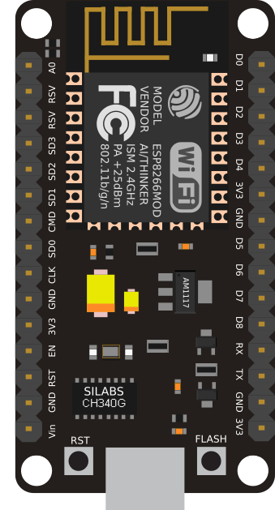
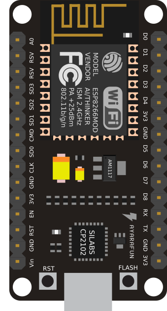

## ESP8266 Drivers

In this folder you can find the latest drivers for all the ESP8266 boards.

Depending on your board, you may need the `CH34x` drivers or the `CP210x` drivers.

 &nbsp; &nbsp; 

**NOTE:** If you are unsure on which drivers you need, just install both